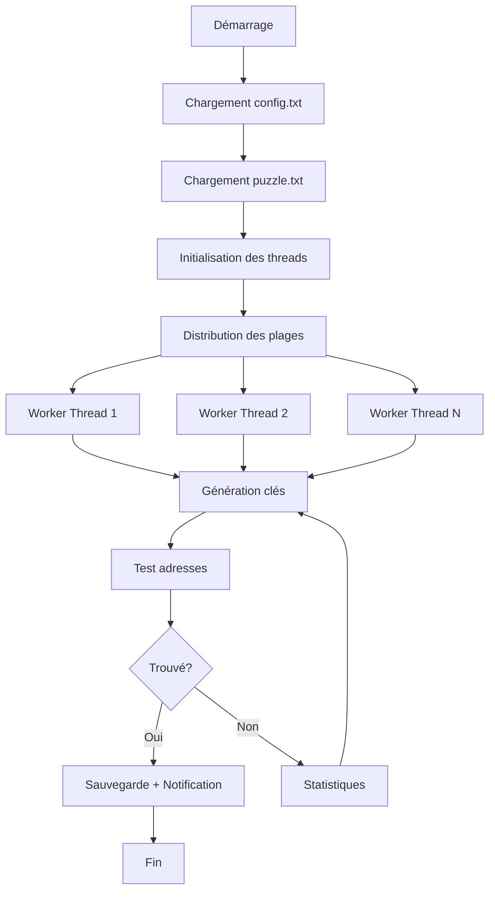

# Documentation complète - Solveur de Puzzle Bitcoin

## 📋 Table des matières
1. [Vue d'ensemble](#vue-densemble)
2. [Prérequis et installation](#prérequis-et-installation)
3. [Fonctionnement du script](#fonctionnement-du-script)
4. [Configuration détaillée](#configuration-détaillée)
5. [Modes de recherche](#modes-de-recherche)
6. [Exemples d'utilisation](#exemples-dutilisation)
7. [Fonctionnalités avancées](#fonctionnalités-avancées)
8. [Surveillance et résultats](#surveillance-et-résultats)
9. [Optimisation des performances](#optimisation-des-performances)
10. [Dépannage](#dépannage)

## 🎯 Vue d'ensemble

Ce script Rust est un solveur de puzzle Bitcoin optimisé qui recherche des clés privées correspondant à des adresses Bitcoin connues. Il utilise plusieurs algorithmes de recherche et optimisations pour maximiser les performances.

### Principe de base
- **But** : Trouver les clés privées correspondant à des adresses Bitcoin spécifiques
- **Méthode** : Génération et test de clés privées dans une plage définie
- **Parallélisation** : Utilise tous les cœurs CPU disponibles 
- **Modes** : Sequential, Random, Smart, Kangaroo

## 🛠️ Prérequis et installation

### Prérequis système
```bash
# Rust (version 1.70+)
curl --proto '=https' --tlsv1.2 -sSf https://sh.rustup.rs | sh

# Dépendances système (Ubuntu/Debian)
sudo apt update
sudo apt install build-essential pkg-config libssl-dev
```

### Dépendances Rust (Cargo.toml)
```toml
[dependencies]
bitcoin = "0.30"
ibig = "0.3"
rand = "0.8"
rayon = "1.7"
num_cpus = "1.16"
reqwest = { version = "0.11", features = ["blocking"] }
chrono = { version = "0.4", features = ["serde"] }
```

### Compilation
```bash
# Cloner le projet
git clone <votre-repo>
cd bitcoin-puzzle-solver

# Compilation optimisée
cargo build --release

# L'exécutable sera dans ./target/release/
```

## 🔧 Fonctionnement du script

### Architecture générale



### Processus détaillé

1. **Initialisation**
   - Lecture du fichier de configuration
   - Chargement des adresses cibles
   - Division de la plage entre les cœurs CPU

2. **Génération de clés**
   - Selon le mode choisi (séquentiel, aléatoire, smart, kangaroo)
   - Génération de variants (compressé/non-compressé)
   - Optimisations mathématiques (patterns, sauts)

3. **Vérification**
   - Conversion clé privée → adresse Bitcoin
   - Comparaison avec la liste d'adresses cibles
   - Test des variants compressés et non-compressés

4. **Résultats**
   - Sauvegarde dans `found.txt`
   - Notifications Telegram (optionnel)
   - Points de contrôle automatiques

## ⚙️ Configuration détaillée

### Fichier config.txt

Au premier lancement, le script crée automatiquement un fichier `config.txt` :

```ini
# Fichier de configuration pour le solveur de puzzle Bitcoin OPTIMISÉ

# Plage de recherche (décimal ou hexadécimal avec 0x)
start=0x20000000000000000
end=0x3ffffffffffffffff

# Nombre de cœurs CPU (0 = auto-détection)
cores=0

# Mode de recherche
mode=smart

# Paramètres de recherche
switch_interval=1000000
subinterval_ratio=0.001
stop_on_find=false

# Fichier des adresses cibles
puzzle_file=puzzle.txt

# Algorithmes avancés
baby_steps=true
giant_steps=true
bloom_filter=false
smart_jump=true

# Performance
batch_size=10000
checkpoint_interval=10000000

# Notifications Telegram (optionnel)
telegram_bot_token=
telegram_chat_id=
```

### Paramètres expliqués

| Paramètre | Description | Exemple | Recommandation |
|-----------|-------------|---------|----------------|
| `start` | Début de la plage | `0x1` ou `1` | Selon le puzzle |
| `end` | Fin de la plage | `0xFFFFF` | Selon le puzzle |
| `cores` | Nombre de cœurs | `8` ou `0` | `0` pour auto |
| `mode` | Algorithme de recherche | `smart` | `smart` ou `random` |
| `switch_interval` | Clés avant changement | `1000000` | 100K-10M |
| `subinterval_ratio` | Taille sous-intervalle | `0.001` | 0.001-0.1 |
| `stop_on_find` | Arrêt à la découverte | `true` | `true` |
| `batch_size` | Clés par lot | `10000` | 1K-50K |

## 🎲 Modes de recherche

### 1. Mode Sequential
```ini
mode=sequential
```
- **Principe** : Teste les clés une par une dans l'ordre
- **Avantages** : Couverture complète, reproductible
- **Inconvénients** : Prévisible, peut être lent
- **Usage** : Petites plages, vérification complète

### 2. Mode Random
```ini
mode=random
```
- **Principe** : Génère des clés aléatoires dans la plage
- **Avantages** : Imprévisible, peut trouver rapidement
- **Inconvénients** : Peut tester plusieurs fois la même clé
- **Usage** : Grandes plages, recherche rapide

### 3. Mode Smart (Recommandé)
```ini
mode=smart
```
- **Principe** : Combine aléatoire + patterns mathématiques
- **Algorithmes** :
  - Inversion des chiffres
  - Ajout/soustraction de séquences de Fibonacci
  - Multiplication par nombres premiers
  - Permutations des chiffres
- **Avantages** : Plus intelligent, couvre les patterns communs
- **Usage** : Recommandé pour la plupart des cas

### 4. Mode Kangaroo
```ini
mode=kangaroo
```
- **Principe** : Implémentation basique de l'algorithme Pollard's Kangaroo
- **Principe** : Sauts calculés dans la plage
- **Avantages** : Efficace pour certains types de problèmes
- **Usage** : Expérimental

## 💡 Exemples d'utilisation

### Exemple 1 : Puzzle Bitcoin #64
```ini
# Configuration pour le puzzle #64
start=0x8000000000000000
end=0xFFFFFFFFFFFFFFFF
cores=0
mode=smart
switch_interval=5000000
stop_on_find=true
```

### Exemple 2 : Recherche dans une petite plage
```ini
# Plage réduite pour test
start=1
end=1000000
cores=4
mode=sequential
stop_on_find=true
```

### Exemple 3 : Recherche continue avec notifications
```ini
# Recherche 24/7 avec Telegram
start=0x20000000000000000
end=0x3ffffffffffffffff
mode=random
stop_on_find=false
telegram_bot_token=1234567890:AABBccDDee...
telegram_chat_id=-1001234567890
```

### Fichier puzzle.txt

Créez un fichier `puzzle.txt` avec les adresses à rechercher :

```
# Adresses Bitcoin à trouver
1BgGZ9tcN4rm9KBzDn7KprQz87SZ26SAMH
1CUTxxxx...
1EHNa6Q4Jz2uvNExL497mE43ikXhwF6kZm
# Commentaires possibles avec #
```

## 🚀 Fonctionnalités avancées

### Points de contrôle automatiques
- Sauvegarde toutes les 1000 clés testées
- Fichiers : `checkpoint_core_0.txt`, `checkpoint_core_1.txt`, etc.
- Reprise automatique après redémarrage

### Variants d'adresses
Pour chaque clé privée, le script teste :
- **Adresse compressée** : Format moderne (commence par 1)
- **Adresse non-compressée** : Format legacy (commence par 1)
- **Adresses P2SH** : Format multi-signature (commence par 3)

### Optimisations mathématiques

#### Patterns Smart Mode
```rust
// Exemples de patterns générés
Base: 12345678
- Inversé: 87654321
- +Fibonacci: 12345679, 12345680, 12345681, 12345683...
- *Premiers: 24691356, 37037034, 61728390...
- Permutations: 21345678, 13245678, 12354678...
```

## 📊 Surveillance et résultats

### Statistiques en temps réel
```
📊 [Stats] Total: 15847296 | Vitesse: 2847 clés/s | Instantané: 2901 clés/s | Temps: 1:32:15
```

### Fichier found.txt
```
[2024-06-24 14:32:17] Trouvé! Clé privée: L4rK3d..., Adresse: 1BgGZ9tcN4rm9KBzDn7KprQz87SZ26SAMH
```

### Notifications Telegram

#### Configuration du bot
1. Créer un bot avec @BotFather
2. Obtenir le token : `1234567890:AABBccDDee...`
3. Ajouter le bot à un chat/groupe
4. Obtenir le chat_id avec @userinfobot

#### Configuration
```ini
telegram_bot_token=1234567890:AABBccDDee...
telegram_chat_id=-1001234567890
```

## 🏎️ Optimisation des performances

### Recommandations CPU
| Processeur | Cœurs recommandés | batch_size |
|------------|-------------------|------------|
| Intel i5 4 cœurs | 4 | 5000 |
| Intel i7 8 cœurs | 8 | 10000 |
| AMD Ryzen 16 cœurs | 16 | 15000 |
| Serveur 32+ cœurs | 32 | 25000 |

### Paramètres de performance
```ini
# Pour CPU puissant
batch_size=25000
switch_interval=10000000
checkpoint_interval=50000000

# Pour CPU faible
batch_size=1000
switch_interval=100000
checkpoint_interval=1000000
```

### Surveillance système
```bash
# Utilisation CPU
htop

# Température
watch sensors

# Mémoire
free -h
```

## 🔧 Dépannage

### Problèmes courants

#### 1. "Impossible d'ouvrir le fichier puzzle"
```bash
# Vérifier l'existence du fichier
ls -la puzzle.txt

# Créer un fichier de test
echo "1BgGZ9tcN4rm9KBzDn7KprQz87SZ26SAMH" > puzzle.txt
```

#### 2. "Valeur de départ invalide"
```ini
# ❌ Incorrect
start=0xGGGG

# ✅ Correct
start=0x8000000000000000
start=1000000
```

#### 3. Performances faibles
```ini
# Réduire la taille des lots
batch_size=1000

# Augmenter l'intervalle de switch
switch_interval=10000000
```

#### 4. Notifications Telegram non reçues
```bash
# Tester le bot manuellement
curl -X POST "https://api.telegram.org/bot<TOKEN>/sendMessage" \
     -d "chat_id=<CHAT_ID>&text=Test"
```

### Logs de debug

Ajoutez des logs pour diagnostiquer :
```rust
println!("Debug: Clé testée = {}", key_val);
println!("Debug: Adresse générée = {}", address_str);
```

## 📈 Exemples de plages par puzzle

### Puzzles Bitcoin populaires
```ini
# Puzzle #64
start=0x8000000000000000
end=0xFFFFFFFFFFFFFFFF

# Puzzle #65  
start=0x10000000000000000
end=0x1FFFFFFFFFFFFFFFF

# Puzzle #66
start=0x20000000000000000
end=0x3FFFFFFFFFFFFFFFF

# Test rapide (puzzle résolu)
start=1
end=1000000
```

## 🎯 Conseils d'utilisation

### Pour débutants
1. Commencez avec une petite plage de test
2. Utilisez `mode=sequential` pour comprendre
3. Activez `stop_on_find=true`
4. Surveillez les statistiques

### Pour utilisateurs avancés
1. Utilisez `mode=smart` pour l'efficacité
2. Optimisez `batch_size` selon votre CPU
3. Configurez les notifications Telegram
4. Lancez plusieurs instances sur différentes plages

### Sécurité
- **Ne partagez jamais les clés privées trouvées**
- Sauvegardez régulièrement `found.txt`
- Utilisez des connexions sécurisées pour Telegram
- Vérifiez les adresses avant utilisation

---

## 🚨 Avertissement légal

Ce script est fourni à des fins éducatives et de recherche uniquement. L'utilisation pour accéder à des fonds Bitcoin sans autorisation peut être illégale. Utilisez de manière responsable et éthique.

---

*Documentation mise à jour : Juin 2025*